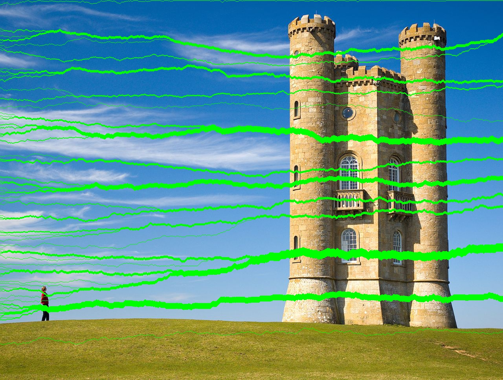
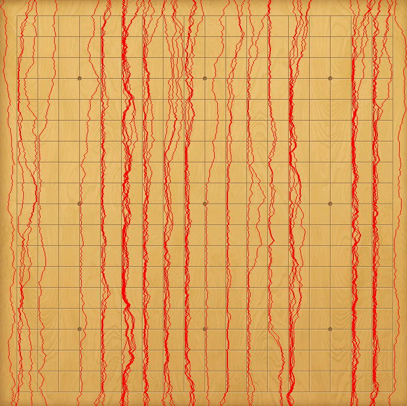
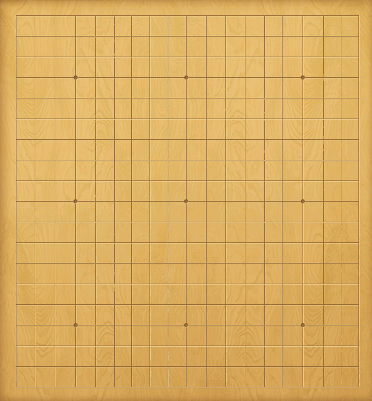
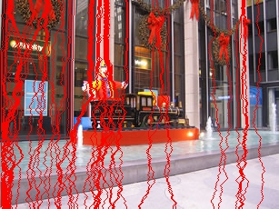
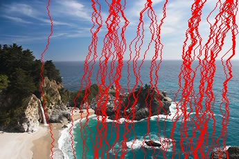
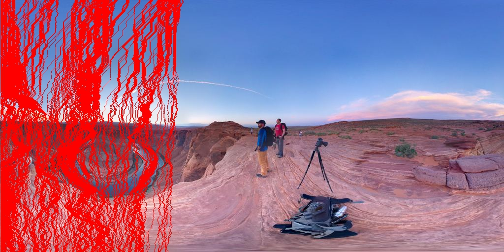
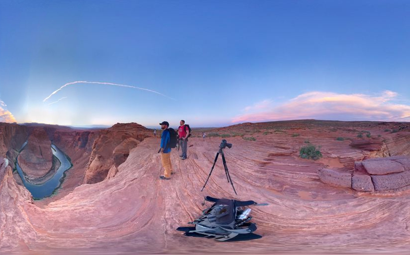
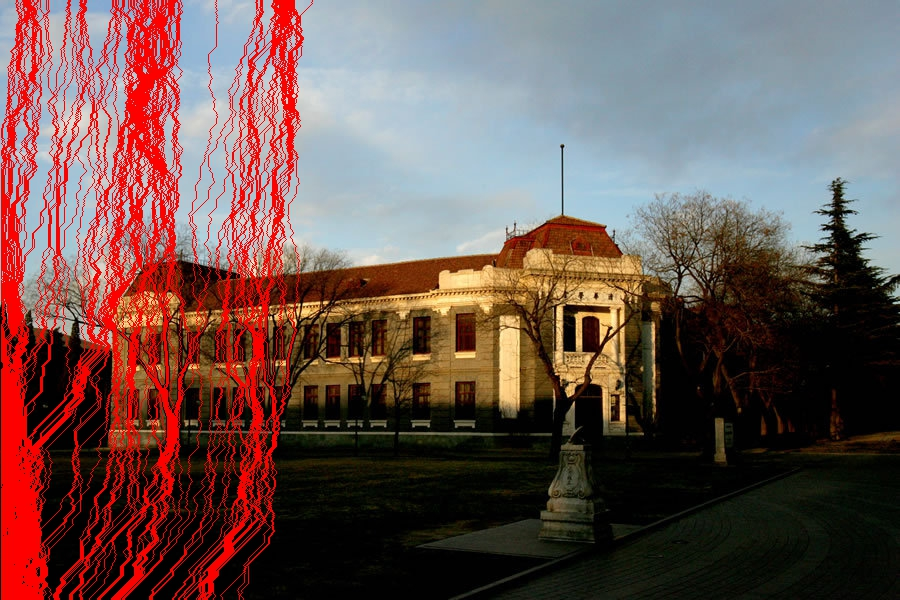
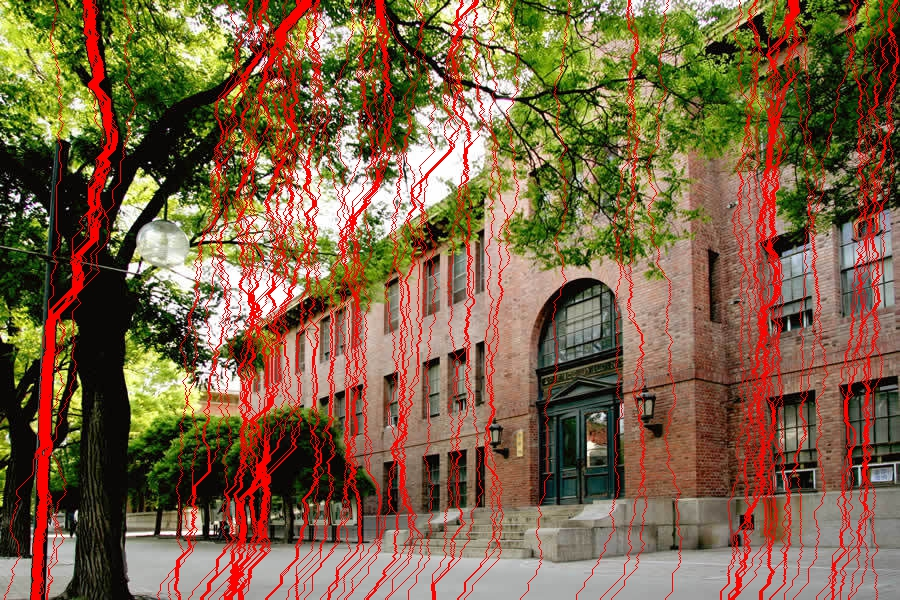

# SeamCarver

Seam Carving for Content-Aware Image Resizing, C++ Implement.

## 项目依赖

- MacOS or Linux
- CImg
- C++ 11

## 编译运行

### MacOS

若有Xcode，直接打开Projects下的SeamCarver.xcodeproj，否则如下Linux

### Linux

~~~
$ cd Sources
$ make
$ ./SeamCarver
~~~

## 效果图

